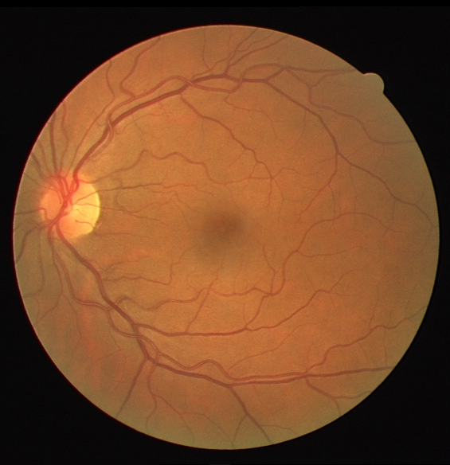
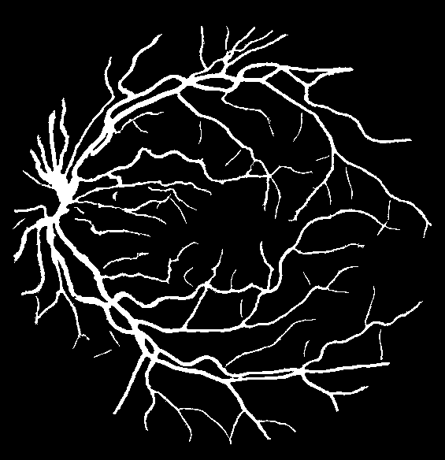
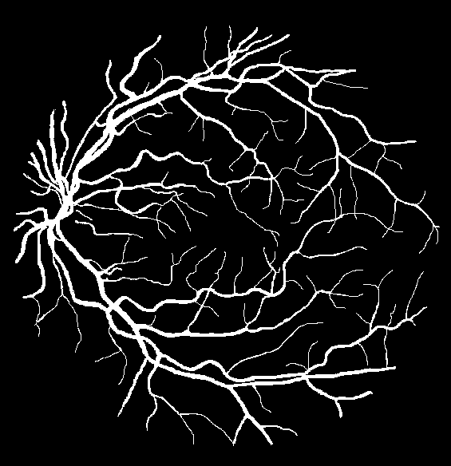

# Vessel Segmentation in Retinal Images

## Introduction

The package contains the implementation of the vessel segmentation method described in the paper:

Gy. Kovacs and A. Hajdu. "A Self-Calibrating Approach for the Segmentation of Retinal Vessels
by Template Matching and Contour Reconstruction". In: Medical Image Analysis 29(4) (2016).
pp. 24-46. DOI: 10.1016/j.media.2015.12.003

For the preprint, check https://www.researchgate.net/publication/334732374_An_empirical_comparison_and_evaluation_of_minority_oversampling_techniques_on_a_large_number_of_imbalanced_datasets

If you use the method, please consider citing the paper:

```bibtex
@article{j006,
  author="Gy. Kov\'acs and A. Hajdu",
  title="A Self-Calibrating Approach for the Segmentation of Retinal Vessels by Template Matching and Contour Reconstruction",
  journal="Medical Image Analysis",
  journallink={https://www.journals.elsevier.com/medical-image-analysis},
  issn={1361-8415},
  volume="29(4)",
  pages="24--46",
  year="2016",
  impf="IF-2016=4.188",
  doi={10.1016/j.media.2015.12.003},
  group="journal",
  preprint = {https://drive.google.com/open?id=0B3E8L0dtBKcsUUtSRWloVFpCRlE},
  link = {http://www.medicalimageanalysisjournal.com/article/S1361-8415(15)00184-X/fulltext?cc=y=},
  code = {http://github.com/gykovacs/vessel}
}
```
## Illustration

Input Image | Output Image | Manual Annotation
:---------------------:|:-----------------:|:---------------:|
 |  |

## Minor I/O problem

Something changed in the libtiff package so tiff image reading/writing is incorrect, tiff images should be converted to png/jpg/bmp before segmentation.

## Using through Docker

This is the recommended way to use the software.

### Clone the repo

```bash
> git clone git@github.com:gykovacs/vessel.git
```

### Build the Docker image

In the root of the repo, issue

```bash
> docker build --pull --rm -f "Dockerfile" -t vessel:latest "."
```

### Use the software by the following command

Supposing that the source images are stored in the directory `<path_of_dir_containing_images>`

```bash
> docker run -it --env-file env_file --rm -a stdout -v <path_of_dir_containing_images>:/data vessel:latest python3 /usr/src/vessel/scripts/vessel.py drive /data/01_test.png /data/01_segmentation.png
```

## Building from source

This section can be skipped if the code is being used from Docker.

The software was tested on Ubuntu 20.04 and Windows 10.

The code is written in C++ with a Python wrapper for the ease of command line applications.

### Linux (Ubuntu)

   1. libpng12 + dev
   2. libz + dev
   3. libjpeg8 + dev
   4. libtiff5 + dev
   5. gsl-bin + dev
   6. python3 + dev

### Installation of requirements in Ubuntu

```bash
> sudo apt install libpng16-16 libpng-dev libjpeg8 libjpeg8-dev libz3-4 libz3-dev libtiff5 libtiff5-dev gsl-bin libgsl-dev
```

### Windows

   1. libpng (http://gnuwin32.sourceforge.net/packages/libpng.htm)
   2. libz (http://gnuwin32.sourceforge.net/packages/zlib.htm)
   3. libjpeg (http://gnuwin32.sourceforge.net/packages/jpeg.htm)
   4. libtiff (http://gnuwin32.sourceforge.net/packages/tiff.htm)
   5. gsl (http://gnuwin32.sourceforge.net/packages/gsl.htm)
   6. mingw32-pthreads-w32
   7. python 3.5+ (https://www.python.org/downloads/windows/)

In order to get things work in Windows, it is highly recommended to set-up a working
MinGW environment (http://www.mingw.org/), and install the mingw32-pthreads-w32 in it using
the graphical installer. 

Be sure that all the dlls installed with the packages above and with MinGW are present
in Windows' PATH variable.


## Building the code

### Clone the repo

```bash
> git clone git@github.com:gykovacs/vessel.git
```

### Build

In the root directory of the repo:

```bash
> cd src
> cmake .
> make
```

## Using the software without installation

The build process creates shared object files and binary executables in the `lib64` and `bin64` folders of the root project directory.

Add the path of the `lib64` folder to the `LD_LIBRARY_PATH` and the path of the `bin64` folder to the `PATH` environment variables.

## Installing the code

> make install

The package installs:
   1. some shared objects/dlls containing general image processing methods,
   2. an application called "vessel"/"vessel.exe", which contains the implementation of the segmentation method,
   3. a Python script which is intended to be used as the main interface of the method,
   4. the model descriptor files trained on the STARE and DRIVE databases.

## Checking that the environment works

If everything is installed and the PATH variables are set properly, opening a command line
the command

```bash
> vessel.py
```

should write the help and usages on the screen:

```bash
Usages:
vessel.py drive <input> <output>
vessel.py stare <input> <output>
vessel.py drive-scale <image0> [<image1>]...
vessel.py stare-scale <image0> [<image1>]...
vessel.py drive-cn <input> <scale> <output>
vessel.py stare-cn <input> <scale> <output>
vessel.py drive-ca <input> <scale> <output>
vessel.py stare-ca <input> <scale> <output>
vessel.py help
```

## Use cases

Generally, the algorithm writes temporary files to the directory in which it is
executed. It is highly recommended to create an empty directory and call the vessel.py
method in that empty directory. When the segmentation is finished, the vessel.py
scripts removes every file it created, so there is no need to worry about the disk
space.

### Simple segmentation

In this case the models trained on DRIVE or STARE are used for segmentation.
This is useful only if the size of the image content to be segmented is similar to
that of the images in DRIVE or STARE. Using the DRIVE model:

```bash
> vessel.py drive dir1/<input> dir2/<output>
```

Note that the input and output images reside in another directory than the working
directory. 

Using the STARE model:

```bash
> vessel.py stare dir1/<input> dir2/<output>
```

This usecase is not the one which can be used in practice, since it gives the best results
only if the content of the images has the same scale as the training images of DRIVE or
STARE.

### Estimating the scale

In order to apply the method to an unseen input image, one has to estimate the scaling
factor between the image content of the training images and that of the unseen image.

This can be done manually or in an automated way, as well.

Coarse/manual estimations: a simple, coarse estimation of the scale factor can be achieved by
simply dividing the number of columns in the training images by the number of columns
in the unseen input image. For example, for the DRIVE model, one must divide the width
of the DRIVE training images (584 pixels) by the width of the image to be segmented.
Say, the image to be segmented has 3000 pixels in each row. Then, the scale factor is
determined as 584/3000 = 0.194. Another way is to divide the radius of the ROI in the
training images by the radius of ROI in the image to be segmented.

Clearly, this estimation has to be done only once for one source of images. However,
the coarse/manual estimations can be time consuming and erroneous as the ratio of
image widths may deviate from the real scale of the patterns (like the width of the
largest vessels) in the images. To overcome this issue, the proposed method can be
used to determine the right scaling factor automatedly.

Automated estimation: the method needs a couple of images from the same source and
tries to determine the scaling factor between the images of the training dataset and
that of the unseen images. The method writes the estimated scale on the console and
also into the file imgscale.txt. When the scaling factor for the DRIVE model is
determined:

```bash
> vessel.py drive-scale <image1> <image2> ... <imageN>
```

The proper number of images to be used is 5-10.

For the STARE model:

```bash
> vessel.py stare-scale <image1> <image2> ... <imageN>
```

### Segmenting unseen images without further calibration

Once the scaling factor is estimated either manually or using the proposed automated
technique, the unseen image can be segmented by the following command using the DRIVE
model:

```bash
> vessel.py drive-cn <input> <scale> <output>
```

Or using the STARE model:

```bash
> vessel.py stare-cn <input> <scale> <output>
```

The postfix cn refers to "no calibration", in this case the automated calibration
techniques described in the paper are not applied. The segmentation is relatively
fast, but it is not the bast one achievable using the vessel package.

### Segmenting unseen images with further calibration

Using the DRIVE model, one can carry out the segmentation with the blind calibration
techniques as

```bash
> vessel.py drive-ca <input> <scale> <output>
```

Or using the STARE model:

```bash
> vessel.py stare-ca <input> <scale> <output>
```

The postfix ca refers to "all calibrations".
